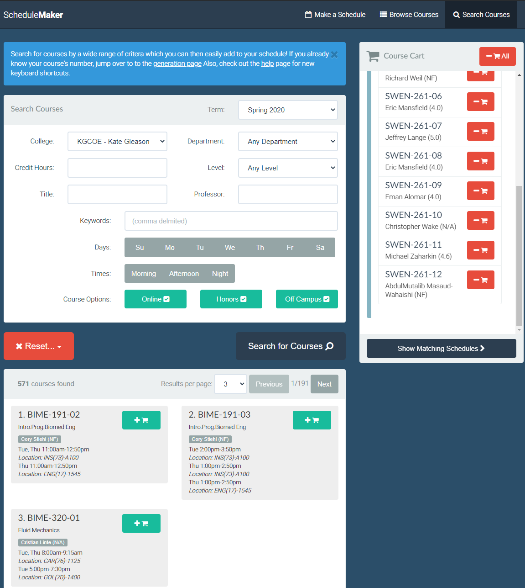

# RIT Rate My Professors Extension

[**Chrome** extension][link-chrome] 

[**Firefox** addon][link-firefox] [][link-firefox]

[Click here for the version that works for any school](https://github.com/CalvinWu4/Any-School-Rate-My-Professors-Extension)

This extension shows the [Rate My Professors](https://www.ratemyprofessors.com/) ratings of professors while searching for classes on [Tiger Center](https://tigercenter.rit.edu/tigerCenterApp/api/class-search) and [CSH Schedule Maker](https://schedulemaker.csh.rit.edu/).

Professors' names will link to their Rate My Professors page (or the search results if not found).

The most helpful rating is chosen as the most recent rating with the most net upvotes (regardless of the quality given). (The most helpful rating on Rate My Professors always has an "Awesome" overall quality.) Also, the "Would take again" value won't show up unless there are eight or more ratings and the majority of ratings answer that question. 

To better find professors, this extension will try the first part of a hyphenated last name, different middle/last name combos, and the middle name as the first name. It will also try all associated nicknames or diminutive names for first names from [here](https://github.com/carltonnorthern/nickname-and-diminutive-names-lookup). For example, Thomas Reichlmayr on RIT's course search is found as Tom Reichlmayr on Rate My Professors. Finally, there is the [`addedNicknames.js`](https://github.com/CalvinWu4/Rate-My-Professor-Extension/blob/master/addedNicknames.js) file for custom nicknames (e.g. Thiagarajah Arujunan should refer to Al Arujunan).

[link-chrome]: https://chrome.google.com/webstore/detail/rate-my-professors-for-ri/lcionigofpcbfpmnipnioapimoggnbda?hl=en&authuser=0 "Version published on Chrome Web Store"
[link-firefox]: https://addons.mozilla.org/en-US/firefox/addon/rate-my-professors-for-rit/ "Version published on Mozilla Add-ons"

## Building

The build process goes through a few stages.

If you just want to run a build, use one of the following commands based on whether you want dev/prod builds and what browser you are building for:
- `npm run build-dev:chrome`
- `npm run build-dev:firefox`
- `npm run build:chrome`
- `npm run build:firefox`

You'll probably want to `npm install` first if you haven't already.

`npm run release` will run the `clean`, `build:chrome`, and `build:firefox` targets to generate two production zip files from a clean build folder which should be ready for distribution

To run the extension in your browser for development purposes, follow these instructions:

https://developer.mozilla.org/en-US/docs/Mozilla/Add-ons/WebExtensions/Your_first_WebExtension

Testing the output to ensure extensions are valid (using `web-ext lint`) is done automatically as part of the build process. Packaging the extension into a .zip file is also automatic.

To run unit tests: `npm run test`